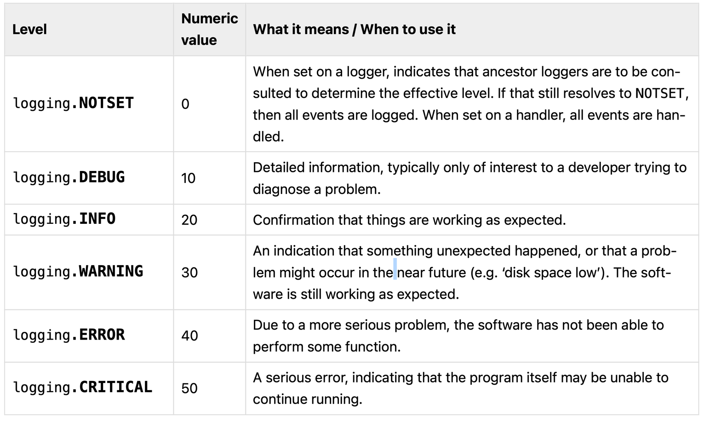

# Python Logging: An In-Depth Guide

**Overview:**

- Introduction to Python's logging module
- Understanding log levels
- Basics of Python logging
- Exploring Filters, Handlers, Root Logger, and Formatters
- Configuring logging using `logging.config.dictConfig`
- Creating a custom log handler by inheriting from `logging.Handler`
- Creating custom loggers and setting different log levels for separate modules

---

## 1. Introduction to Python’s Logging Module

Python’s built-in logging module provides a flexible framework for emitting log messages from Python programs. It is designed to meet the needs of both simple scripts and complex applications.

Key Features:
• Multiple log levels
• Configurable output destinations (handlers)
• Message formatting
• Filtering capabilities
• Hierarchical loggers

## 2. Understanding Log Levels

Log levels indicate the severity or importance of the events being logged. Python’s logging module defines the following standard log levels:



```python
import logging

# Setting up basic configuration
logging.basicConfig(level=logging.DEBUG)

# Logging messages with different severity levels
logging.debug("This is a DEBUG message.")
logging.info("This is an INFO message.")
logging.warning("This is a WARNING message.")
logging.error("This is an ERROR message.")
logging.critical("This is a CRITICAL message.")
```

Output:

```
DEBUG:root:This is a DEBUG message.
INFO:root:This is an INFO message.
WARNING:root:This is a WARNING message.
ERROR:root:This is an ERROR message.
CRITICAL:root:This is a CRITICAL message.
```

## 3.Basics of Python Logging

### 3.1 Basic Configuration

The simplest way to configure logging is using logging.basicConfig(). This function configures the root logger and sets the log level, format, and output destination.

```python
import logging

# Basic configuration
logging.basicConfig(
    level=logging.INFO,
    format='%(asctime)s - %(name)s - %(levelname)s - %(message)s',
    datefmt='%Y-%m-%d %H:%M:%S',
    handlers=[
        logging.StreamHandler()  # Logs to console
    ]
)

# Logging messages
logging.info("This is an INFO message.")
logging.debug("This DEBUG message will not appear because the level is set to INFO.")
```

Output:

```
2025-01-23 10:00:00 - root - INFO - This is an INFO message.
```

### 3.2 The root Logger

The root logger is the default logger used by the logging module. If no other logger is specified, log messages are sent to the root logger.

```python
import logging

# Basic configuration with root logger
logging.basicConfig(level=logging.WARNING, format='%(levelname)s:%(name)s:%(message)s')

# Logging messages
logging.debug("Root logger DEBUG message.")   # Will not appear
logging.warning("Root logger WARNING message.")  # Will appear
```

Output:

```
WARNING:root:Root logger WARNING message.
```

## 4. Exploring Filters, Handlers, Root Logger, and Formatters

[](https://www.youtube.com/watch?v=9L77QExPmI0)

### 4.1 Handlers

Handlers determine where the log messages are sent. Python’s logging module provides several built-in handlers:

- StreamHandler: Logs to streams like sys.stdout or sys.stderr.
- FileHandler: Logs to a file.
- RotatingFileHandler: Logs to a file, rotating it at a certain size.
- SMTPHandler: Sends logs via email.
- … and more.

Example: Logging to Both Console and File

```python
import logging

# Create a custom logger
logger = logging.getLogger('my_logger')
logger.setLevel(logging.DEBUG)

# Create handlers
console_handler = logging.StreamHandler()
console_handler.setLevel(logging.INFO)

file_handler = logging.FileHandler('app.log')
file_handler.setLevel(logging.DEBUG)

# Create formatters and add them to handlers
formatter = logging.Formatter('%(asctime)s - %(name)s - %(levelname)s - %(message)s')
console_handler.setFormatter(formatter)
file_handler.setFormatter(formatter)

# Add handlers to the logger
logger.addHandler(console_handler)
logger.addHandler(file_handler)

# Logging messages
logger.debug("This is a DEBUG message.")
logger.info("This is an INFO message.")
logger.warning("This is a WARNING message.")
```

Output (Console):

```
2025-01-23 10:00:00 - my_logger - INFO - This is an INFO message.
2025-01-23 10:00:00 - my_logger - WARNING - This is a WARNING message.
```

Content of app.log:

```
2025-01-23 10:00:00 - my_logger - DEBUG - This is a DEBUG message.
2025-01-23 10:00:00 - my_logger - INFO - This is an INFO message.
2025-01-23 10:00:00 - my_logger - WARNING - This is a WARNING message.
```

### 4.2 Formatters

Formatters define the layout of log messages. They can include attributes like timestamp, logger name, log level, and the actual message.

Custom Formatter:

```python
import logging

# Create a formatter with a different format
formatter = logging.Formatter(
    fmt='%(levelname)s:%(name)s:%(message)s',
    datefmt='%H:%M:%S'
)

# Create a handler and set its formatter
handler = logging.StreamHandler()
handler.setFormatter(formatter)

# Create a logger and add the handler
logger = logging.getLogger('formatted_logger')
logger.setLevel(logging.DEBUG)
logger.addHandler(handler)

# Logging messages
logger.info("This is an INFO message.")
logger.error("This is an ERROR message.")
```

OUTPUT:

```
INFO:formatted_logger:This is an INFO message.
ERROR:formatted_logger:This is an ERROR message.
```

### 4.3. Filters

Filters provide a finer-grained facility for determining which log records to output. They can be used to filter out messages based on attributes like logger name, module, or custom criteria.

Example: Custom Filter to Exclude DEBUG Messages

```python
import logging

class NoDebugFilter(logging.Filter):
    def filter(self, record):
        return record.levelno != logging.DEBUG

# Create a logger
logger = logging.getLogger('filtered_logger')
logger.setLevel(logging.DEBUG)

# Create handlers
console_handler = logging.StreamHandler()
console_handler.setLevel(logging.DEBUG)

# Add filter to handler
console_handler.addFilter(NoDebugFilter())

# Create formatter and set it to handler
formatter = logging.Formatter('%(levelname)s:%(name)s:%(message)s')
console_handler.setFormatter(formatter)

# Add handler to logger
logger.addHandler(console_handler)

# Logging messages
logger.debug("This DEBUG message will be filtered out.")
logger.info("This INFO message will appear.")
logger.warning("This WARNING message will appear.")
```

```
INFO:filtered_logger:This INFO message will appear.
WARNING:filtered_logger:This WARNING message will appear.
```

## 5. Best Practices for Python Logging

1. Use Appropriate Log Levels:
   - Reserve DEBUG for detailed diagnostic information.
   - Use INFO for general application flow messages.
   - WARNING for unexpected events or minor issues.
   - ERROR for serious issues preventing certain functionalities.
   - CRITICAL for severe errors causing program termination.
2. Avoid Logging from the Root Logger:
   - Instead, create named loggers using logging.getLogger(**name**) to facilitate hierarchical logging configurations.
3. Configure Logging Early:
   - Set up logging configurations at the entry point of your application (e.g., in main.py) to ensure all modules inherit the configuration.
4. Use Handlers and Formatters Effectively:
   - Direct logs to appropriate destinations (console, files, external systems) using handlers.
   - Maintain consistent and informative log formats with formatters.
5. Leverage Filters for Granular Control:
   - Use filters to include or exclude specific log records based on custom criteria.
6. Avoid Excessive Logging:
   - Excessive logging, especially at high verbosity levels like DEBUG, can clutter logs and impact performance.
7. Secure Sensitive Information:
   - Ensure that sensitive data is not logged, especially in production environments.
8. Rotate Log Files:
   - Use handlers like RotatingFileHandler or TimedRotatingFileHandler to manage log file sizes and prevent disk space exhaustion.
